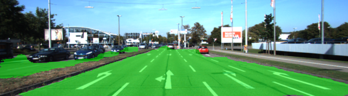

# Semantic Segmentation

## Introduction

Since AlexNet trounced other techniques at image 
classification at ILSVRC in 2012, deep learning has 
enjoyed growing popularity and become a favourite 
technique for solving many computer vision-related 
problems. Growing research in this field has been carried 
out over the last few years and we are now able to use
deep neural networks to perform the following tasks, 
among many others:
* [image classification](https://medium.com/@tifa2up/image-classification-using-deep-neural-networks-a-beginner-friendly-approach-using-tensorflow-94b0a090ccd4)
* [object detection and localization](https://towardsdatascience.com/understanding-ssd-multibox-real-time-object-detection-in-deep-learning-495ef744fab)
* semantic segmentation

The rest of this short post will discuss what semantic 
segmentation is and how we implemented and trained a
well-known network architecture to be able to detect 
pixels on a image that belong to a road.

## Semantic Segmentation

While image classification consists in assigining a 
single class to an image (e.g. dog/cat), **semantic 
segmentation consists in assigning a class for each pixel within an image**. In this fashion we are able to 
accurately identify objects of interest at pixel accuracy.

The image below shows examples of original images along 
with their segmented counterparts

### Neural Network Architecture

We used the FCN network from the paper [_Fully Convolutional Networks For Semantic Segmentation_](https://arxiv.org/pdf/1605.06211.pdf). The variant of 
the FCN network employed is the _FCN8_ network, which is 
itself built on top of the venerable [VGG16](https://arxiv.org/pdf/1409.1556.pdf) architecture. 
Unlike VGG though, FCN has the following improvements:
* it can operate on images of different sizes
* it performs pixel wise classification as oppose to image-wide classification

One important charateristic in FCN is that there are no 
fully connected layers at the end of the base VGG16 
network: they have been replaced by _fully convolutional_ 
networks where a 1x1 filter is applied to the input 
feature map. This helps preservation the height and width 
dimensions of the feature map while also performing 
dimensionality reduction in the _channel_ dimension of 
the feature map. The paper states it very clearly too:

As our network architecture is _FCN8_ we built extra 
layers by combining the fully convolutional layers that 
were created from VGG's pooling layers, just like in the 
paper.

Naturally, we also used transposed convolution (sometimes 
incorrectly named _deconvolutions_) to upsample the image
to the point where it reaches its original size.

### Results

We conducted multiple experiments, with the following 
configurations:
* toggling [batch normalization](https://www.quora.com/Why-does-batch-normalization-help)
* Using bigger kernel sizes in transposed convolution (i.e. upsampling)
* varying dropout levels

We obtain our best results by training the network in 75 epochs with **no batch normalization** and using the **original kernel sizes from the FCN paper**. A **dropout keep percentage value of 0.65 was used**. Moreover, learning rate and l2 regularization values of 0.001 were used. The optimizer used was _Adam_.

The images below show how our trained network performed 
against test images it had never seen:

#### Interesting thoughts about Failed Experiments 

To our surprise we obtained worse results by using batch normalization as can be shown by the images below:

This is probably due to the fact that we lose pixel level
information since we subtract the mean and divide by the 
standard deviation of the batch. This technique is 
therefore not suitable for segmentation because we are 
working at pixel and not image level.

Interestingly, we also noticed less convincing results 
when we employed bigger kernel sizes for the upsampling layers. The segmented parts of the road are a lot more _coarse_ : this is probably because a larger kernel would
cover a greater portion of the image and has a bigger 
chance of misclassiying pixels. The images below 
illustrate what we are referring to:

## Improvements

We believe we can improve results further by trying the 
following:
* training for longer number of epochs while varying learning rate
* experimenting with more values of dropout
* training on a larger dataset (e.g. [cityscapes](https://www.cityscapes-dataset.com/))
* use a different base layer (e.g. ResNets)

## Acknowledgements

As usual, I would like to thank the Udacity team for the 
great content and challenging project. Moreover, we are 
grateful to NVIDIA for working with Udacity on this 
module.